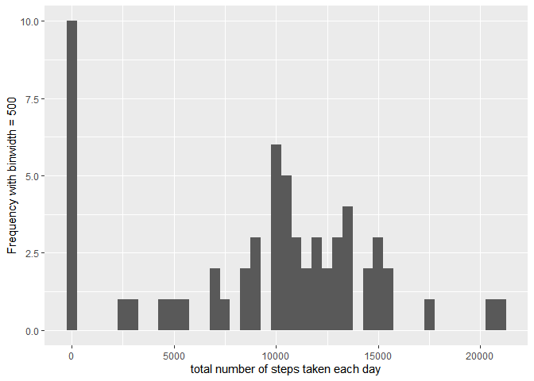
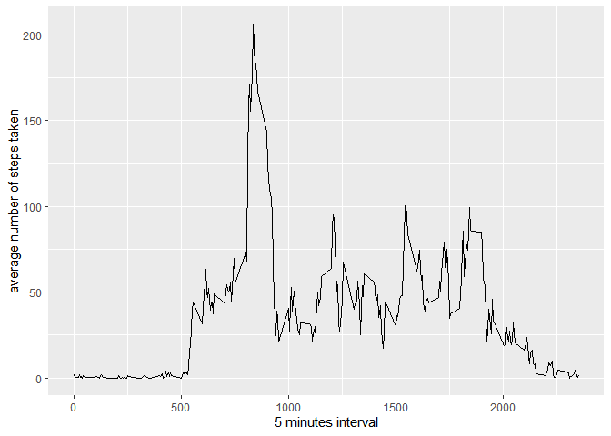
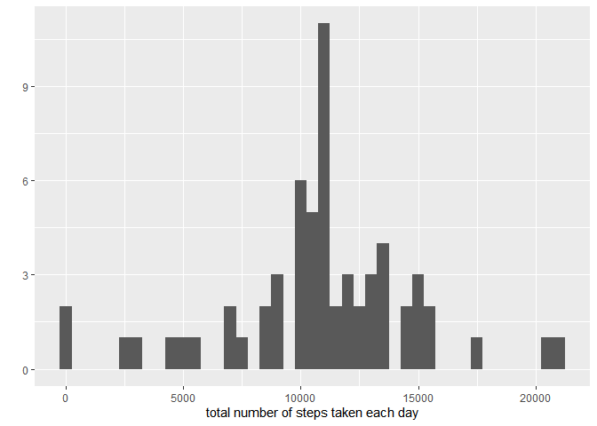
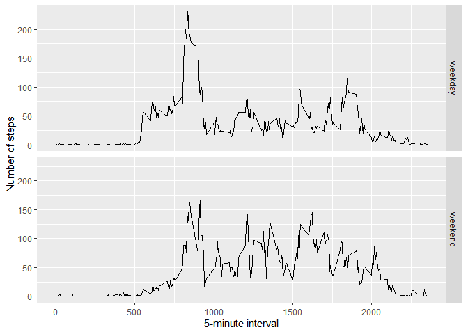

## Loading and preprocessing the data
##### 1. Load the necessary libraries

```r
library(ggplot2)
library(scales)
library(Hmisc)
```
##### 2. Unzip and Loading file

```r
if(!file.exists('activity.csv')){
  unzip('activity.zip')
}
data <- read.table('activity.csv', header = TRUE, sep = ',')
```
##### 2. Checking the data

```r
summary(data)
str(data)
dim(data)
```
##### 2. Changing the type of date

```r
data$date <- as.Date(data$date, "%Y-%m-%d")
```
## Mean total number of steps taken per day with histogram
##### 1. Histogram of total number of steps taken each day

```r
total.steps <- tapply(data$steps, data$date, FUN = sum, na.rm = TRUE)
qplot(total.steps, binwidth = 500, xlab ='total number of steps taken each day', ylab = 'Frequency with binwidth = 500')
```

<!-- -->

```r
mean(total.steps, na.rm = TRUE)
median(total.steps, na.rm = TRUE)
```
##### 2. Mean and median

```r
Mean <- mean(total.steps, na.rm = TRUE)
Median <- median(total.steps, na.rm = TRUE)
```
* Mean     : 9354.2295082
* Median   : 10395

----

## Average daily activity pattern
##### 1.Time series plot

```r
average <- aggregate(x = list(steps = data$steps), by = list(interval = data$interval),
                     FUN = mean, na.rm = TRUE)
ggplot(data = average, aes(x = interval, y = steps))+
  geom_line()+
  xlab('5 minutes interval')+
  ylab('average number of steps taken')
```

<!-- -->

##### 2. 5-minute interval on average across all the days in the dataset that contains the maximum number of steps

```r
mostSteps <- which.max(average$steps)
timeMostSteps <- average[mostSteps,][1,1]
answer <- gsub("([0-9]{1,2})([0-9]{2})", "\\1:\\2",timeMostSteps)
```
* Most Steps at: 8:35

----

## Imputing missing values
##### 1. The total number of missing values

```r
numMissingVal <- length(which(is.na(data$steps)))
```
* Number of missing values: 2304

##### 2. Replacing missing values with mean value of its 5-minute interval

```r
fill.value <- function(steps,interval){
  filled <- NA
  if (!is.na(steps))
    filled<- c(steps)
  else
    filled <- (average[average$interval == interval, 'steps'])
  return (filled)
}
filled.data <- data
filled.data$steps <- mapply(fill.value, filled.data$steps, filled.data$interval)
```
##### 3. Using filled dataset to make histogram of total number of steps taken each day and calculate mean and median

```r
total.steps <- tapply (filled.data$steps, filled.data$date, FUN = sum)
qplot(total.steps, binwidth = 500, xlab = 'total number of steps taken each day')
```

<!-- -->

```r
Meanafter <- mean(total.steps)
Medianafter <- median(total.steps)
```
* Mean (Imputed)    : 1.0766189\times 10^{4}
* Median (Imputed)  : 1.0766189\times 10^{4}
The values are higher then before with missing data because those missing values are replaced with mean value of `steps`.

## Are there differences in activity patterns between weekdays and weekends?
##### 1. Create new factor variable with two levels ??? ???weekday??? and ???weekend???

```r
weekday.or.weekend <- function(date){
  day <- weekdays(date)
  if (day %in% c('Monday','Tuesday','Wednesday','Thursday','Friday'))
    return('weekday')
  else if (day %in% c('Saturday','Sunday'))
    return('weekend')
  else
    return('invalid date')
}
filled.data$day <- sapply(filled.data$date, FUN = weekday.or.weekend)
```
##### 2. Panel plot containing a time series plot

```r
average <- aggregate(steps ~ interval + day, data = filled.data ,mean)
ggplot(average,aes(interval, steps))+
  geom_line()+
  facet_grid(day ~ .)+
  xlab('5-minute interval')+
  ylab('Number of steps')
```

<!-- -->

